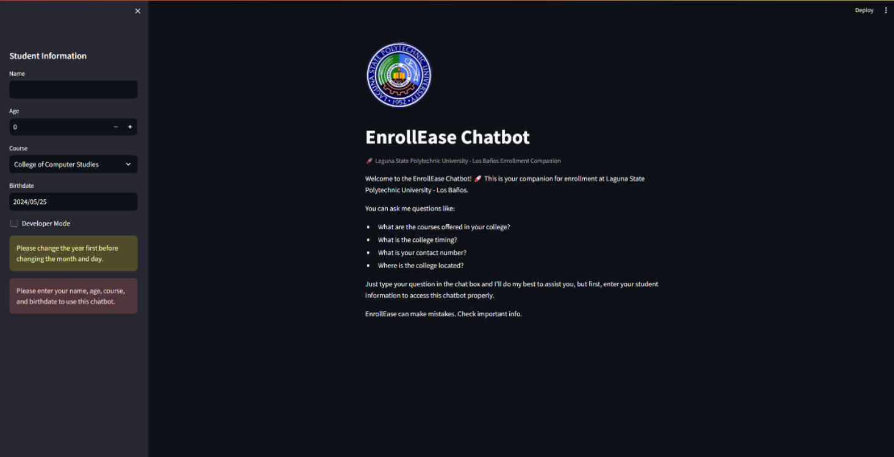

# LSPU Enrollment Chatbot



A simple chatbot built with **Streamlit** and **Natural Language Processing (NLP)** to automate and streamline student inquiries for LSPU Enrollment.

## Features

- Handles frequently asked questions
- Streamlit-based web interface
- NLP-powered response generation

## Tech Stack

- Python
- Streamlit
- Natural Language Processing (NLP)

## How to Run

```bash
streamlit run app.py
